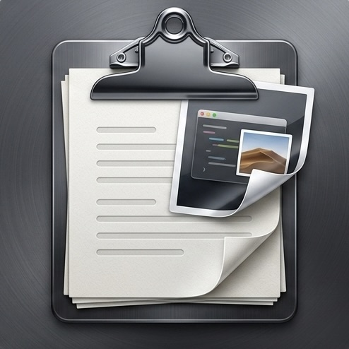
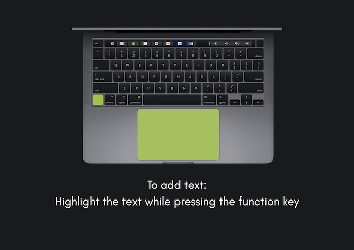
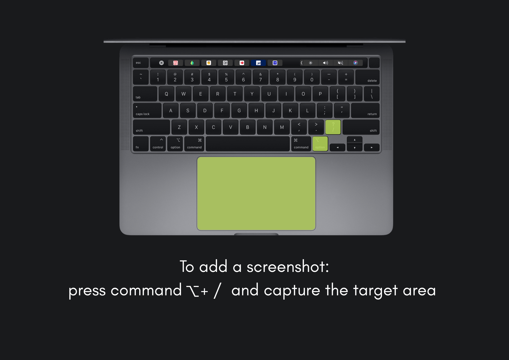
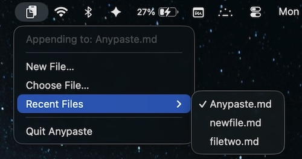

  

<h1 align="center">Anypaste</h1>

<em> Anypaste is a frictionless macOS menu bar utility that allows you to instantly capture text and screenshots from anywhere on the screen and append them directly to your active Markdown files without interrupting your workflow. </em>

<em> No more manually copying, pasting and constant switching between files.</em>

<em> Built  with Swift and AppKit.</em>

  
  
  
  
  
  
  

  
  

## Features
* ***Menu Bar Agent***: Runs quietly in the background without cluttering your Dock. Easy access from the menu bar (look up :).
* ***Quick Capture***: press `function` and highlight text to append text to your choice of file, and `(⌥ + /)` keys to grab a screenshot, and it seamlessly appends to your designated file. 
* ***Pixel-Perfect:*** Anypaste doesn't mess with your image dimensions. The image size in your Markdown file maps exactly to your screen capture, pixel by pixel, preserving original fidelity without unwanted scaling.
* ***Native macOS Aesthetics***: Features a custom-designed metallic icon and smooth crossfade animations.
* ***Zero Friction***: Built for students, researchers, developers, and writers who need to learn and collect data at the speed of thought.
* ***Lightweight Footprint*** : Built natively with Swift and AppKit, Anypaste consumes minimal CPU and memory, ensuring your Mac's battery life and performance remain entirely unaffected.
* **Dropdown Menu Options**: 
  

    
  

  
  * **Appending to** &rarr; The current file being appended.
  * **New file** &rarr; Create a new file anywhere and start!
  * **Choose file** &rarr; Choose any markdown file of your choice, any file!
  * **Recent files** &rarr; Shows the last 3 edited files for quick access.
  * **Quickly open the current file being appended by pressing command + option + O**
---
  * **Demonstration**:

  

---
# Give the repo a ⭐️ so you don't miss future updates.

## Installation steps
1. Clone this repository and open `Anypaste.xcodeproj` in Xcode.
2. Ensure the build target is set to **My Mac**.
3. Go to **Product > Archive**, then click **Distribute App > Custom > Copy App**.
4. Save the compiled `Anypaste.app` to your Mac's **Applications** folder.
5. Launch the app. (Note: On first launch, macOS will prompt you to grant Accessibility permissions in `System Settings > Privacy & Security > Accessibility` so the app can detect your capture shortcuts).
6. Grant the app `Screen and System Audio Recording` permissions in `System Settings > Privacy & Security > Screen and System Audio Recording` so that the app can take and append screenshots.

---

## Requirements
* **macOS:** 12.0 or later (Monterey+) recommended for modern AppKit functionality.
* **Xcode:** 14.0 or later (if compiling from source).

## Contributors
A massive thank you to the contributors who helped build and shape Anypaste:
* **Meghana Agnur** : https://github.com/meghanaagnur
* **Ruchira Jagshettiwar** : https://github.com/ruchirajags

## Contributing
Contributions, issues, and feature requests are always welcome! Feel free to check the issues page if you want to contribute to the project.

## License
This project is open-source and available under the [MIT License](https://choosealicense.com/licenses/mit/).
